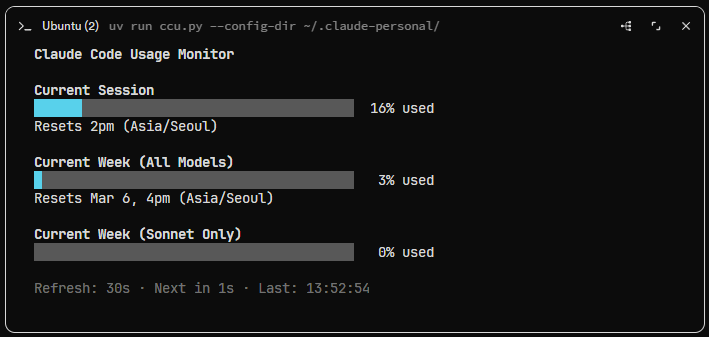
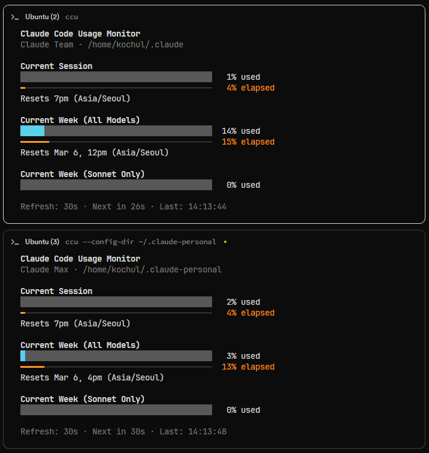

# claude-simple-usage (`ccu`)

Real-time Claude Code usage monitor. Runs `/usage` in a hidden tmux session and displays accurate server-side data.

### Vanilla mode (`--no-pace --no-profile`)

Almost identical to Claude Code's built-in `/usage` screen:



### Full mode (default)

Adds pace bars (elapsed time comparison) and profile info. Supports monitoring multiple profiles simultaneously:



## Quick Start

One-liner with uvx (no install needed):

```bash
uvx --from git+https://github.com/kochul2000/claude-simple-usage.git ccu
```

Or install with pip/uv:

```bash
pip install git+https://github.com/kochul2000/claude-simple-usage.git
ccu
```

Or just download and run:

```bash
curl -sO https://raw.githubusercontent.com/kochul2000/claude-simple-usage/master/ccu.py
python3 ccu.py
```

## Install as a command

```bash
python3 ccu.py install
```

You can bake in preset flags:

```bash
python3 ccu.py install --no-pace --config-dir ~/.claude-personal
```

This generates a wrapper script in `~/.local/bin/ccu` with your flags built in. You can still pass additional flags at runtime. To remove:

```bash
ccu uninstall
```

Make sure `~/.local/bin` is in your `PATH`.

## Requirements

- **tmux** — `brew install tmux` / `sudo apt install tmux`
- **claude** — [Claude Code CLI](https://docs.anthropic.com/en/docs/claude-code)

## Usage

```bash
ccu                            # refresh every 30s (default)
ccu 15                         # refresh every 15s
ccu --config-dir ~/.claude     # use specific config directory
ccu --no-pace                  # start with pace bar hidden
ccu --no-profile               # start with profile info hidden
ccu --once                     # fetch once and exit
ccu --debug                    # show raw tmux output
ccu install                    # install ccu to ~/.local/bin
ccu install --no-pace          # install with preset flags
ccu uninstall                  # remove ccu from ~/.local/bin
```

## Keys

| Key | Action |
|---|---|
| `r` | Immediate refresh |
| `w` / `s` | Adjust refresh interval (w=+5s, s=-5s, 3s–120s) |
| `a` / `d` | Adjust bar width (a=-5, d=+5) |
| `e` | Toggle pace bar (elapsed time comparison) |
| `q` | Toggle profile info |
| `h` / `ESC` | Toggle help |
| `Ctrl+C` | Exit |

## How it works

1. Starts Claude Code in a hidden tmux session
2. Sends `/usage` command periodically
3. Parses the TUI output for usage percentages and reset times
4. Displays a clean dashboard with progress bars and pace comparison

## License

MIT
